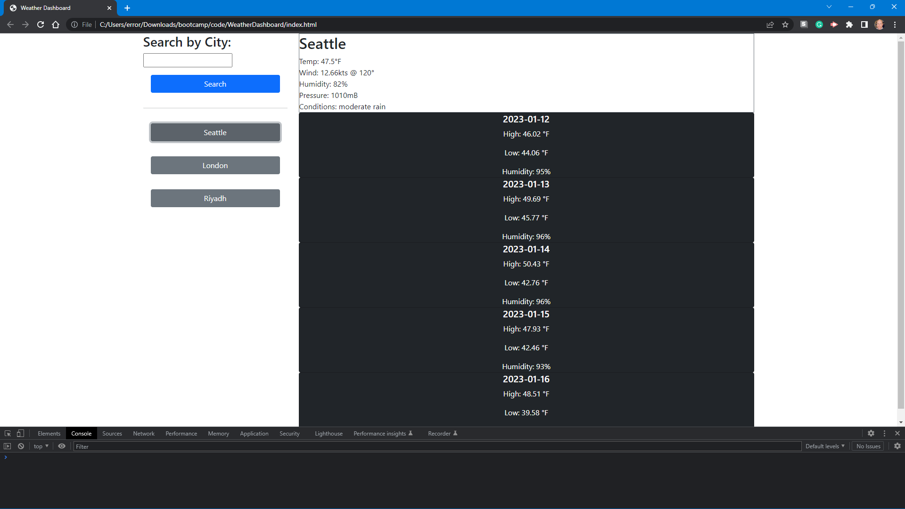

# WeatherDashboard

## Description

The purpose of this project was to learn to use 3rd party APIs to display relevant information about the weather.

## Table of Contents (Optional)

- [Installation](#installation)
- [Usage](#usage)
- [Credits](#credits)
- [License](#license)

## Installation

To clone this repository, at the command prompt type:

```
git clone git@github.com:error201/WeatherDashboard.git
```

## Usage

Visit [WeatherDashboard.](https://error201.github.io/WeatherDashboard/)
Enter the name of the city you would like a forecast for in the search bar. Any cities you have previously searched will be displayed as a button that you can click to do a quick search.




## Credits

This project relied heavily on:
   - Bootstrap: https://www.getbootstrap.com
   - JQuery: https://www.jquery.com
   - Day.js: https://dayjs.org
   - OpenWeatherMap: https://openweathermap.org


## License

This repo is covered under the MIT license. Please read [MIT License](LICENSE) for details..

---

## Badges


## How to Contribute

Fell free to clone and/or fork this repository!